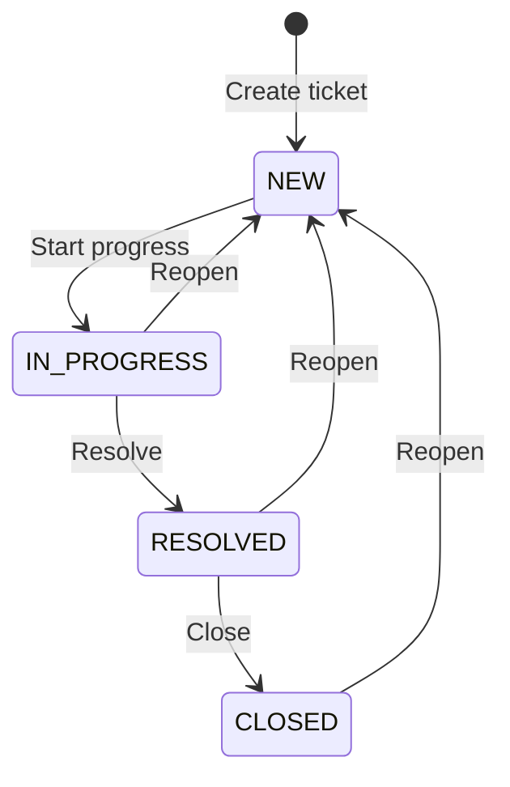

# feat: #6 Tickets — Support Ticket System

## Overview

Add a ticketing system for IT support requests. Users create tickets, staff track them through a status flow (New → In Progress → Resolved → Closed), assign them to team members, and optionally link them to assets.

## Problem Frame

IT teams need structured tracking for support requests — hardware issues, software problems, access requests. Without it, requests get lost in email/chat. This feature provides a ticket lifecycle with status, priority, and assignment. (see origin: `docs/brainstorms/2026-04-09-feature-scope-requirements.md` R5)

## Requirements Trace

- R5. Tickets — open tickets with status flow (New → In Progress → Resolved), assignment, priority

## Scope Boundaries

- Simple status tracking only — no SLA timers, no due dates, no escalation rules (see origin: deferred question resolved)
- No knowledge base/FAQ — deferred to future issue
- No email notifications on ticket changes — deferred to Notifications feature integration
- Ticket permissions follow existing role matrix: USER can create/read, MANAGER/ADMIN can do everything

## Context & Research

### Relevant Code and Patterns

- `src/lib/actions/roles.ts` — server action pattern (Zod + auth guard + ActionResult)
- `src/lib/auth-guards.ts` — `requirePermission("ticket.create")` etc.
- `src/lib/permissions.ts` — ticket permissions already defined in ROLE_MATRIX
- `src/app/(dashboard)/tickets/page.tsx` — placeholder page to replace
- `prisma/schema.prisma` — User and Setting models, enum patterns

### Institutional Learnings

- Pages with DB queries must use `export const dynamic = "force-dynamic"`
- Client components define types locally, not from `@/generated/prisma`
- All shadcn/ui components must follow `.claude/rules/styling.md` glassmorphism spec
- Mock server actions in tests with `vi.mock` to avoid next-auth import issues

## Key Technical Decisions

- **Simple status tracking:** No SLA, no due dates, no timers. Just status flow. Keeps scope small for a 5-20 person team.
- **Status flow:** NEW → IN_PROGRESS → RESOLVED → CLOSED. Any ticket can be reopened (status set back to NEW).
- **Permissions:** Follows existing role matrix — USER can create/read tickets, MANAGER/ADMIN can update/delete. All users can update their own tickets' status.
- **Asset linking:** Optional `assetId` field — tickets can reference an asset but don't have to. No Asset model exists on main yet, so use a nullable string field for now.
- **Hard delete:** Admin/Manager can delete tickets (no soft delete — tickets are not reference data).

## Open Questions

### Resolved During Planning

- **SLA complexity:** Simple status tracking only. No timers, no due dates. (Resolved with user)
- **Who can create tickets:** All authenticated users per existing permission matrix.
- **Who can update status:** Creator can update their own ticket. MANAGER/ADMIN can update any.

### Deferred to Implementation

- Exact filter UI layout — will follow users-page-client search/filter bar pattern
- Whether to show ticket count badges in the sidebar — can decide during implementation

## High-Level Technical Design

> *This illustrates the intended approach and is directional guidance for review, not implementation specification. The implementing agent should treat it as context, not code to reproduce.*

## Implementation Units

- [ ] **Unit 1: Prisma schema — Ticket model and migration**

**Goal:** Add Ticket model to the database with enums for status and priority

**Requirements:** R5

**Dependencies:** None (User model exists)

**Files:**
- Modify: `prisma/schema.prisma`
- Create: `prisma/migrations/<timestamp>_add_tickets/migration.sql` (auto-generated)

**Approach:**
- Add enums: `TicketStatus` (NEW, IN_PROGRESS, RESOLVED, CLOSED), `TicketPriority` (LOW, MEDIUM, HIGH, CRITICAL)
- Add Ticket model: id, title, description, status, priority, createdById (FK to User), assignedToId (optional FK to User), assetId (optional string, no FK yet), resolvedAt (auto-managed), createdAt, updatedAt
- Add relation fields on User: `ticketsCreated`, `ticketsAssigned`
- Follow conventions: `@map("snake_case")`, `@@map("tickets")`, cuid IDs, timestamps

**Patterns to follow:**
- Existing enum and model definitions in `prisma/schema.prisma`

**Verification:**
- Migration applies cleanly
- Prisma client generates without errors

- [ ] **Unit 2: Server actions — Ticket CRUD**

**Goal:** Backend logic for creating, reading, updating, and deleting tickets

**Requirements:** R5

**Dependencies:** Unit 1

**Files:**
- Create: `src/lib/actions/tickets.ts`
- Test: `tests/integration/tickets-actions.test.ts`

**Approach:**
- `getTickets(filters?)` — list with optional status/priority/search filters, include createdBy and assignedTo names, order by createdAt desc
- `getTicket(id)` — single ticket with relations
- `createTicket(data)` — validate with Zod, set createdById from session via `requirePermission("ticket.create")`
- `updateTicket(id, data)` — validate, auto-set resolvedAt when status → RESOLVED, clear resolvedAt when reopened. Check permission: creator can update own ticket, MANAGER/ADMIN can update any
- `deleteTicket(id)` — hard delete, require `ticket.delete` permission
- `getTicketStats()` — count by status (for future dashboard)
- All mutations revalidate `/tickets`

**Patterns to follow:**
- `src/lib/actions/roles.ts` — Zod schemas, ActionResult type, auth guards
- `src/lib/auth-guards.ts` — `requirePermission()` usage

**Test scenarios:**
- getTickets returns tickets with user names included
- getTickets with status filter returns only matching tickets
- createTicket sets createdById from session
- createTicket validates required fields (title, description)
- updateTicket auto-sets resolvedAt on RESOLVED status
- updateTicket clears resolvedAt when reopened (status → NEW)
- deleteTicket requires ticket.delete permission
- getTicketStats returns correct counts per status

**Verification:**
- All server actions callable, typecheck passes

- [ ] **Unit 3: Tickets page — table with filters**

**Goal:** Full tickets list page with search and status/priority filtering

**Requirements:** R5

**Dependencies:** Unit 2

**Files:**
- Modify: `src/app/(dashboard)/tickets/page.tsx`
- Create: `src/app/(dashboard)/tickets/_components/types.ts`
- Create: `src/app/(dashboard)/tickets/_components/tickets-page-client.tsx`
- Create: `src/app/(dashboard)/tickets/_components/tickets-table.tsx`
- Test: `tests/components/tickets-table.test.tsx`

**Approach:**
- Server page fetches tickets and users list (for assignment dropdown), passes to client
- `export const dynamic = "force-dynamic"`
- Client wrapper with search bar, status/priority filter buttons, "New Ticket" button
- Table columns: Title, Status (badge), Priority (badge), Created By, Assigned To, Created date
- Status badges: NEW=blue, IN_PROGRESS=amber, RESOLVED=green, CLOSED=gray
- Priority badges: LOW=gray, MEDIUM=blue, HIGH=amber, CRITICAL=red
- Click row to open detail modal

**Patterns to follow:**
- `src/app/(dashboard)/users/_components/users-page-client.tsx` — page structure with search + filter
- `src/app/(dashboard)/users/_components/users-table.tsx` — table with badges and actions
- `.claude/rules/styling.md` — glassmorphism spec for all UI

**Test scenarios:**
- Renders ticket data in table rows
- Shows correct status badge colors
- Shows correct priority badge colors
- Shows "—" for unassigned tickets
- Shows empty state when no tickets
- Calls handlers on row interaction

**Verification:**
- Page renders with ticket data from DB
- Filters narrow results correctly

- [ ] **Unit 4: Ticket form modal — create/edit**

**Goal:** Dialog for creating and editing tickets

**Requirements:** R5

**Dependencies:** Unit 2, Unit 3

**Files:**
- Create: `src/app/(dashboard)/tickets/_components/ticket-form-modal.tsx`

**Approach:**
- Fields: title (required), description (required, textarea), priority (select), assignedToId (select from users list, optional)
- React Hook Form + Zod with zodResolver
- On create: call createTicket server action
- On edit: call updateTicket with changed fields
- Toast via sonner on success/error, reset form on close
- Glassmorphism styling per spec

**Patterns to follow:**
- `src/app/(dashboard)/users/_components/user-form-modal.tsx` — modal with RHF + Zod

**Verification:**
- Creating a ticket adds it to the table
- Editing a ticket persists changes

- [ ] **Unit 5: Ticket detail modal — view and status changes**

**Goal:** Modal showing full ticket details with status transition buttons

**Requirements:** R5

**Dependencies:** Unit 2, Unit 3

**Files:**
- Create: `src/app/(dashboard)/tickets/_components/ticket-detail-modal.tsx`

**Approach:**
- Show: title, description, status, priority, created by, assigned to, created at, resolved at
- Status action buttons based on current status:
  - NEW: "Start Progress" button
  - IN_PROGRESS: "Resolve" button, "Reopen" button
  - RESOLVED: "Close" button, "Reopen" button
  - CLOSED: "Reopen" button
- Inline reassignment dropdown (for MANAGER/ADMIN)
- Delete button (MANAGER/ADMIN only) with confirmation
- Edit button to open form modal in edit mode

**Patterns to follow:**
- `src/app/(dashboard)/vendors/_components/vendor-detail-container.tsx` — detail view with actions

**Verification:**
- Status transitions update correctly and reflect immediately
- Delete removes ticket from list
- Reassignment persists

- [ ] **Unit 6: Seed data — dummy tickets**

**Goal:** Seed realistic ticket data for development and testing

**Requirements:** R5

**Dependencies:** Unit 1

**Files:**
- Modify: `prisma/seed.ts`

**Approach:**
- Add 8-10 tickets with varied statuses, priorities, and assignments
- Reference seeded users as creators and assignees
- Include mix: some NEW, some IN_PROGRESS, some RESOLVED, one CLOSED
- Some unassigned, some assigned to different users

**Verification:**
- `pnpm db:seed` succeeds
- Tickets visible on the page after seeding

- [ ] **Unit 7: Tests — integration + component**

**Goal:** Test coverage for tickets feature

**Requirements:** R5

**Dependencies:** Units 2-5

**Files:**
- Create: `tests/integration/tickets-actions.test.ts`
- Create: `tests/components/tickets-table.test.tsx`

**Approach:**
- Integration tests: mock Prisma + auth, test all server actions
- Component tests: render table with mock data, verify badges, empty state

**Test scenarios:**
- Server actions: CRUD operations, status transitions, permission checks, validation errors, resolvedAt auto-management
- Component: renders columns correctly, badge colors, empty state, filter interaction

**Verification:**
- `pnpm test` passes with all new tests
- `pnpm typecheck`, `pnpm lint`, `pnpm build` all succeed

## System-Wide Impact

- **Interaction graph:** Tickets reference User (createdBy, assignedTo). Future: Dashboard will show ticket stats via getTicketStats(). Audit Log will track ticket changes.
- **Error propagation:** Server action errors return `{ success: false, error }` — consistent with existing pattern.
- **State lifecycle risks:** resolvedAt must be auto-managed — set on RESOLVED, cleared on reopen. Single Prisma call per update, no partial-write risk.
- **API surface parity:** getTicketStats() designed for future Dashboard consumption.

## Risks & Dependencies

- Adding relations to User model requires migration — low risk since it's additive (new relation fields, no column changes on users table)
- Optional assetId is a plain string with no FK constraint for now — will be wired up when Asset model lands on main via the wire-up-mock-data PR (#17)

## Sources & References

- **Origin document:** [docs/brainstorms/2026-04-09-feature-scope-requirements.md](docs/brainstorms/2026-04-09-feature-scope-requirements.md)
- Related code: `src/lib/actions/roles.ts`, `src/lib/permissions.ts`
- Related issue: #6
